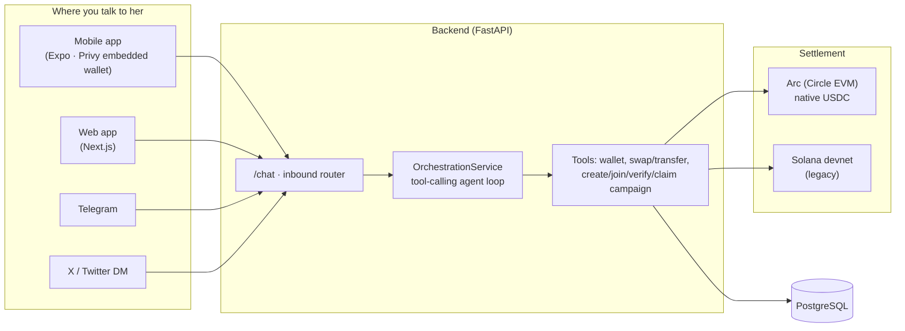
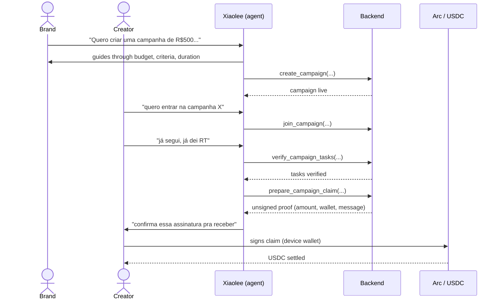
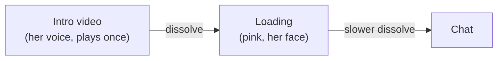
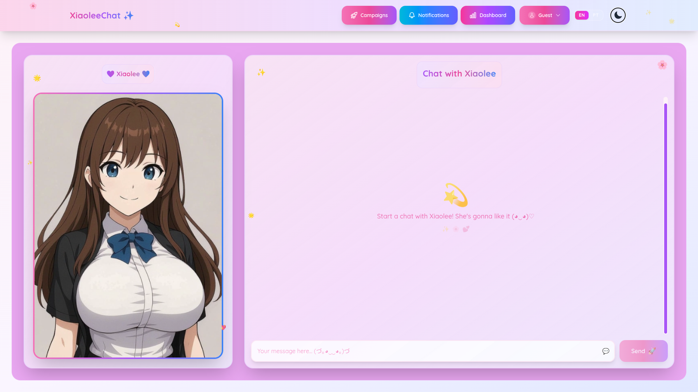
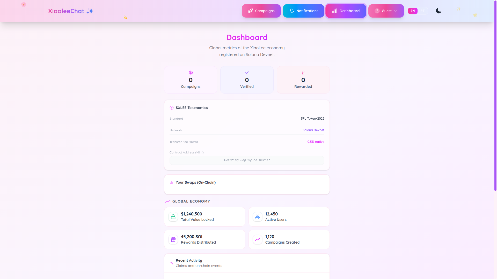
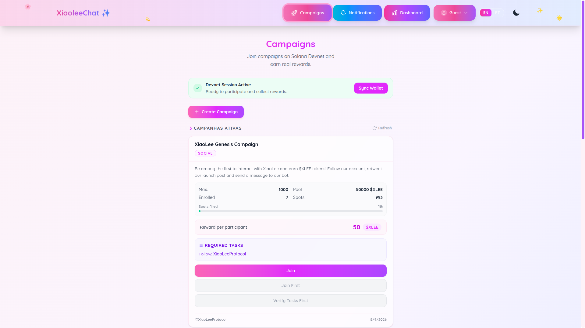
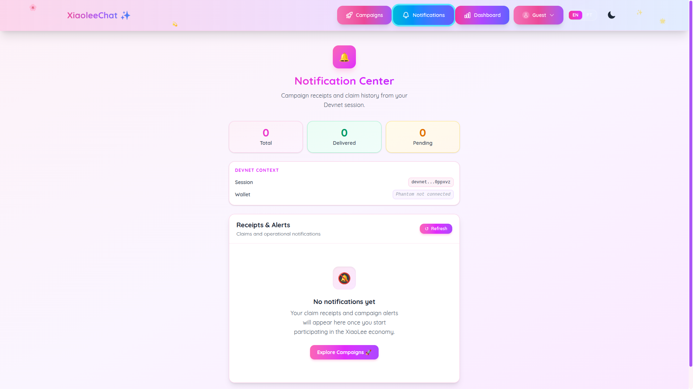

<p align="center">
  
</p>

<h1 align="center">Xiaolee</h1>
<p align="center"><b>Talk to your money.</b></p>

<p align="center">
  Xiaolee is a conversational AI agent that manages your crypto wallet and runs your creator campaigns —
  entirely through chat. No dashboards to learn, no forms to fill. You talk, she executes.
</p>

<p align="center">
  <a href="https://xiaolee-landing-production.up.railway.app">Landing page</a> ·
  <a href="https://xiaolee-landing-production.up.railway.app/assets/xiaolee.apk">Download the app</a> ·
  <a href="../../releases">Releases</a> ·
  <a href="docs/API_REFERENCE.md">API reference</a>
</p>

---

## What she does

Xiaolee sits between you and two things people usually need a dozen different tools for: **your wallet** and
**your creator campaigns**. Both are driven by natural conversation — she calls the right tool underneath, you
never touch a transaction hash or a form.

- **Wallet, hands-free** — check your live USDC balance, send or swap funds, just by asking. Balances update in
  real time on screen, no pull-to-refresh, no navigating away and back.
- **Non-custodial, always** — your embedded wallet is yours. Xiaolee prepares transactions; you (or your device's
  secure enclave) sign them. She never holds your keys.
- **Campaigns, created by talking** — describe a campaign in a sentence ("R$500 pool, 3 dias, RT + follow") and
  she walks you through the rest field by field, then puts it live.
- **Campaigns, joined by talking** — as a creator, tell her you want in. She checks your tasks, verifies them
  live against the platform, and prepares your claim — you just sign it.
- **USDC settlement on Arc** — payouts settle in USDC on Arc (Circle's EVM network), with legacy Solana devnet
  support from where the product started.
- **Wherever you already are** — the same agent answers in the mobile app, the web app, Telegram, and X DMs.
  One brain, four front doors.
- **PT/EN, automatically** — Xiaolee mirrors whichever language you write to her in, no toggle required (there's
  one anyway, for the UI chrome).

## How it works

Every channel talks to one FastAPI backend. A tool-calling LLM loop (`OrchestrationService`) decides what you're
asking for and calls the matching tool — wallet, swap, or campaign — with your identity injected by the backend,
never taken from the model. That's a hard rule in this codebase: **wallet and budget are never a model
parameter.**



### Creating and claiming a campaign — entirely in chat

This is the part that used to be a form. Now it's a conversation on both ends: the brand describes what they
want, Xiaolee builds the campaign; the creator says they're in, Xiaolee checks their work and hands them a
claim to sign.



### First open of the app



Native splash is invisible and matches the video's own background, so the video feels like the very first
thing that happens — no separate splash step, no jump cut between stages.

## Interface

| Chat | Dashboard | Campaigns | Notifications |
|---|---|---|---|
|  |  |  |  |

## Repository layout

This repo is the **mobile-first** home of Xiaolee: the Expo app is the flagship client, and the FastAPI backend
here serves it (plus Telegram and X). The web app has its own repository and backend — they don't share
infrastructure, so a fix here isn't automatically live there.

| Path | What's in it |
|---|---|
| [`mobile/`](mobile/) | The flagship client — Expo/React Native, Privy embedded wallet, expo-router |
| `backend/` | FastAPI — chat orchestration, campaigns, wallet tools, Telegram/X pollers |
| `landing/` | Static landing page (Railway, deployed independently of git) |
| `frontend/` | Legacy Next.js web client — superseded by the separate web repo |
| `solana-program/` | Legacy Anchor program from the project's Solana-native phase |
| `docs/` | Architecture, API reference, design system, mainnet readiness |

## Tech stack

| Layer | Choice |
|---|---|
| Mobile | Expo (SDK 57), React Native, expo-router, Privy embedded wallet |
| Web (legacy, this repo) | Next.js, React, Tailwind |
| Backend | FastAPI, SQLAlchemy 2.0 (async), Alembic |
| Database | PostgreSQL in production, SQLite in dev |
| Agent | Tool-calling LLM loop (`OrchestrationService`), shared across every channel |
| Settlement | Arc (Circle EVM, native USDC), legacy Solana devnet (Anchor/Rust) |
| Messaging channels | In-app chat, Telegram bot, X/Twitter DM |
| Infra | Railway (backend, landing), Redis (rate limiting, optional fallback to in-memory) |
| Observability | Prometheus + Grafana |

## Getting started

```bash
make init                  # Python venv + npm + .env
make dev                   # backend :8000 + web frontend :3000
```

Mobile app (needs the backend running):

```bash
make init-mobile           # first run only
make dev-mobile            # Metro — scan the QR with Expo Go, or a dev-client build
```

See [`mobile/README.md`](mobile/README.md) for the mobile-specific setup, and
[`docs/API_REFERENCE.md`](docs/API_REFERENCE.md) for every route the agent's tools call into.

### Tests

```bash
make test-backend          # pytest
make ci-local               # lint + test + build, same as CI
```

## Deploy

Backend and landing run on **Railway**; the legacy web frontend on **Render**. The backend is a manual
`railway up` deploy (mobile app + Telegram + X all point at it); the landing page deploys the same way,
independent of `git push` — updating `landing/index.html` doesn't go live until someone runs `railway up
--service xiaolee-landing`.

Production builds of the mobile app ship through EAS (`eas build --profile production-apk`); tagging
`mobile-vX.Y.Z` triggers a GitHub Actions release that builds, publishes a GitHub Release with the signed APK,
and updates the landing page's download link on `main`.

| Variable | Where | Purpose |
|---|---|---|
| `CIRCLE_API_KEY`, `CIRCLE_WALLET_ID` | Backend | Arc/Circle USDC payouts |
| `ANTHROPIC_API_KEY` | Backend | Claude — powers the agent's tool-calling loop |
| `DATABASE_URL` | Backend | PostgreSQL in production; empty falls back to SQLite |
| `REDIS_URL` | Backend | Rate limiting; empty falls back to in-memory |
| `EXPO_PUBLIC_API_URL` | Mobile | Baked in at build time — **never** put secrets here |
| `EXPO_PUBLIC_PRIVY_APP_ID`, `EXPO_PUBLIC_PRIVY_CLIENT_ID` | Mobile | Privy embedded wallet |

## Security

- **Wallet and budget are never a model parameter** — the agent decides *what* to do, the backend injects *who*
  and *how much* from the authenticated session, always.
- Non-custodial by construction — every claim, swap, or transfer is prepared unsigned by the backend and signed
  client-side.
- Anti-replay on payment intents; idempotent campaign joins (unique constraint, not a race).
- HMAC-validated Telegram and X webhooks; rate limiting on inbound chat.
- `EXPO_PUBLIC_*` env vars are readable by anyone who downloads the app — build-time config only, never secrets.

## Docs

| File | Contents |
|---|---|
| [`docs/API_REFERENCE.md`](docs/API_REFERENCE.md) | Every route, payload, and error code |
| [`docs/ARCHITECTURE.md`](docs/ARCHITECTURE.md) | Full architecture, diagrams, historical context |
| [`docs/workflows/ARC_LEPTON_ARCHITECTURE.md`](docs/workflows/ARC_LEPTON_ARCHITECTURE.md) | The Arc/Circle migration in detail |
| [`docs/DESIGN_SYSTEM.md`](docs/DESIGN_SYSTEM.md) | Palette, i18n, layout conventions |
| [`docs/MAINNET_READINESS.md`](docs/MAINNET_READINESS.md) | Gates and checklist before mainnet |
| [`mobile/README.md`](mobile/README.md) | Mobile app setup, URL resolution, project structure |
| [`CONTRIBUTING.md`](CONTRIBUTING.md) | Setup, conventions, how to contribute |
